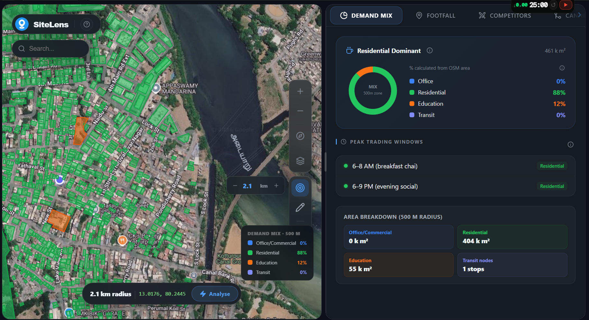
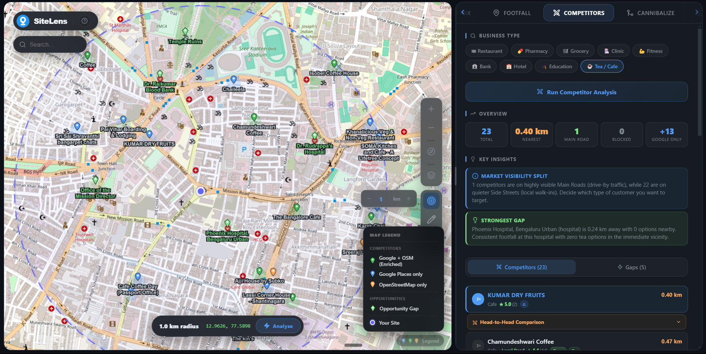
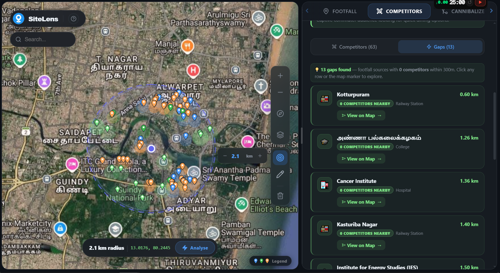
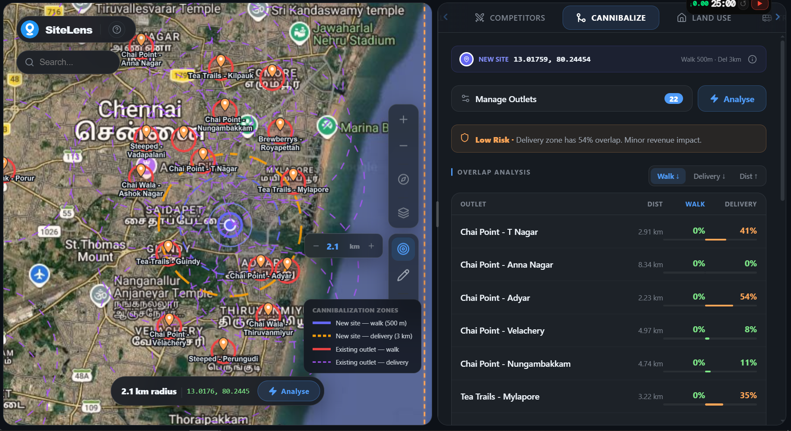
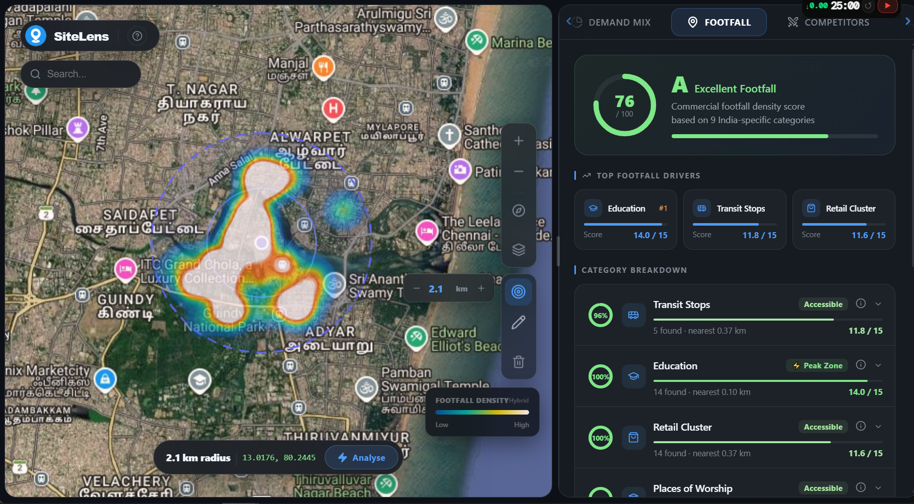

# 🌍 SiteLens — Site Analysis Platform

*A high-performance geospatial intelligence dashboard for data-driven retail expansion and site selection.*

[](https://sitelens.d35ojuq379jh1i.amplifyapp.com/)

---

## 💡 The Solution

Choosing the right location for a retail outlet, cafe, or restaurant is a multi-million dollar decision that is too often driven by gut feeling. We replace guesswork with deterministic, spatial data.

Our platform instantly ingests raw OpenStreetMap footprints, live Google Places data, and local road networks to generate hyper-local intelligence — whether you are avoiding self-cannibalization, identifying competitor blind spots, or predicting peak trading hours based on local zoning.

---

## ✨ Core Features

### 📊 Demand Mix & Peak Prediction
Calculates the exact geometric percentage of Office, Residential, Education, and Transit zones within a 500m radius of your site. Using this data, the platform algorithmically predicts peak trading windows (e.g., morning rushes vs. afternoon breaks) and identifies the core demographic profile of the area.



### ⚔️ Competitor Intelligence & Opportunity Gaps
Merges live Google Places API data with OSM geometries to map competitors with extreme precision. 
*   **Strategic Moats**: Identifies physical barriers (major roads, railways) and footfall anchors (hospitals, colleges) that shield you from competition.
*   **Opportunity Gaps**: Automatically flags highly populated zones that lack specific amenities (e.g., a large tech park with zero cafes within 300m), highlighting immediate expansion opportunities.




### 🛡️ Cannibalization Risk Engine
Upload a CSV of your existing outlet network to instantly assess self-cannibalization risk before signing a lease. The PostGIS engine calculates the exact geometric overlap of Walk (500m) and Delivery (3km) catchments, automatically classifying the new site as Safe, Low Risk, or High Risk.



### 🚶 Footfall & Connectivity
Generates a proprietary Walkability and Footfall score by analyzing road segment density, public transit nodes (bus/metro stops), and surrounding civic amenities directly streamed from the spatial database.



---

## Technical Architecture

*   **Frontend**: React, TypeScript, MapLibre GL JS
*   **Backend**: Node.js, Express, PostGIS (Amazon RDS)
*   **Tile Server**: Martin (Rust-based) streaming ultra-fast PBF vector tiles directly from PostGIS to the client.
*   **Cloud Deployment**: AWS EC2, Application Load Balancer, Amazon ECR

---

## Quick Start (Local Development)

We use a **Single Source of Truth** environment architecture.

### Step 1: Configure Environment Variables
1. **Server**: Copy `server/.env.example` to `server/.env`. Fill in your local PostGIS credentials and your `GOOGLE_PLACES_KEY`.
2. **Client**: Copy `client/.env.example` to `client/.env.development`.

### Step 2: Spin Up the Infrastructure
Run the following from the root of the repository:
```bash
docker-compose up -d
```
This builds and starts the Node.js API (`8080`), the Martin Tile Server (`3000`), and the Python Service (`8000`).

### Step 3: Start the Frontend
```bash
cd client
npm install
npm run dev
```

---

## 📚 Documentation & Guides

*   [**Infrastructure Setup**](./infrastructure/): Modular CFN templates for VPC, RDS, and Backend.
*   [**Database Migration**](./doc/db-migration.md): Guide for moving PostGIS data to AWS RDS.
*   [**Operational Guide**](./doc/operational-guide.md): Connection guides for DBeaver, SSL, and SSM recovery.
*   [**Deployment Scripts**](./scripts/): Automated CI/CD powershell scripts.
